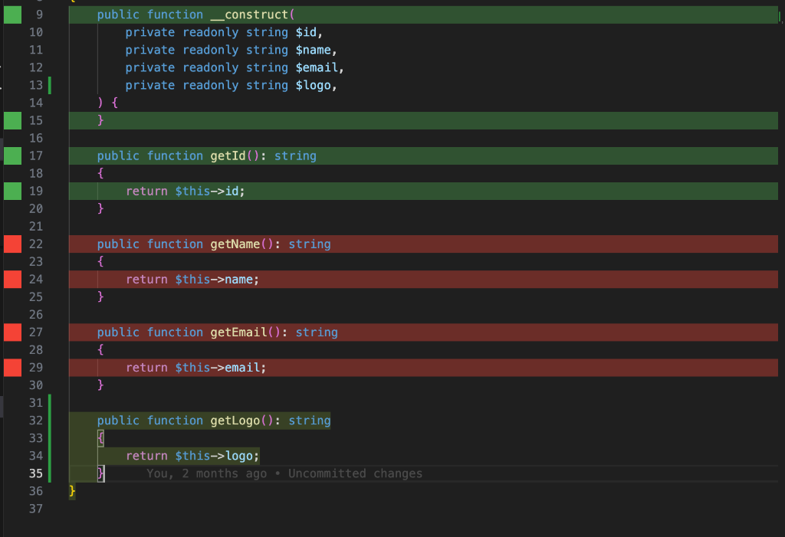

<p align="center">
  
</p>

# PHPUnit Coverage for VS Code

Visualize your PHPUnit code coverage directly in your editor. This extension parses `clover.xml` reports to highlight covered and uncovered lines, providing instant feedback on your test results.



## ✨ Features

- **🔴/🟢 Real-time Coverage**: Instantly see covered (green) and uncovered (red) lines as you code.
- **🔄 Auto-Sync**: The extension watches your `clover.xml` and updates decorations as soon as you run your tests.
- **🛠️ Zero Config**: Works out of the box with standard Clover XML reports.
- **⚡ Performance-Minded**: Efficiently parses reports without slowing down your editor.
- **🔎 Problems Tab**: List all uncovered lines in the VS Code "Problems" tab for a project-wide overview.
- **🤖 Agent Integration**: Quickly send uncovered code to an AI agent for help (via Problems tab or Code Actions).

## 🛠️ Extension Settings

This extension contributes the following settings:

* `phpunit-coverage.cloverPath`: Path to the PHPUnit Clover XML report file. Supports glob patterns (default: `**/clover.xml`).
* `phpunit-coverage.showDecorations`: Show or hide code coverage highlights in the editor (default: `true`).
* `phpunit-coverage.showInProblems`: Show uncovered lines in the "Problems" tab (default: `true`).

## ⌨️ Commands

* `PHPUnit: Show Coverage`: Manually refresh the coverage data from the report file.
* `PHPUnit: Toggle Coverage Highlights`: Toggle the visibility of coverage highlights in your editor.

## 🚀 Getting Started

1. Generate a Clover XML coverage report with PHPUnit:
   ```bash
   phpunit --coverage-clover clover.xml
   ```
2. Open a PHP file in VS Code.
3. The extension will automatically look for a `clover.xml` file. If your file is in a custom location, go to **Settings** (`Cmd+,`), search for `PHPUnit Coverage`, and update the `Clover Path`.
4. Use the command `PHPUnit: Toggle Coverage Highlights` from the Command Palette (`Cmd+Shift+P`) to quickly show or hide the coverage.

## Known Issues

- The extension expects the `clover.xml` file to be present in the workspace.
- Path mapping between the report and the workspace might need adjustment if running tests in Docker/VMs.

## 📝 Release Notes

### 0.0.4

- 🩺 **Problems Tab Integration**: Visualize all uncovered lines in the "Problems" tab for easier navigation.
- 🤖 **AI Agent Integration**: Added "Send to Agent" actions in the Problems view and as a Quick Fix (lightbulb) on uncovered lines.
- 🛣️ **Improved Path Mapping**: Enhanced support for Docker and remote environments through better path resolution logic.
- ⚙️ **New Setting**: Control the visibility of uncovered lines in the Problems tab with `phpunit-coverage.showInProblems`.

### 0.0.3

- 🌐 **Internationalization**: Translated all notifications and code comments to English.
- 🛣️ **Path Normalization**: Improved path matching logic for Windows/Linux compatibility.
- 🩺 **Bug Fix**: Fixed issue with report parsing in certain workspace structures.

### 0.0.2

- ✨ **New Design**: Added a screenshot and improved the overall documentation.
- 🎨 **Toggle Command**: Quickly show/hide coverage with `PHPUnit: Toggle Coverage Highlights`.
- 🛠️ **Configurable**: specify your `clover.xml` path and toggle default visibility in settings.

### 0.0.1

- Initial release with basic Clover XML parsing and line highlighting.
- File system watcher for `clover.xml` updates.

---

**Enjoy!**
